## Vehicle Detection Project
### Steven De Gryze. May, 2018

---

The goals / steps of this project are the following:

* Perform a Histogram of Oriented Gradients (HOG), binned color features, and histograms of color feature extraction on a labeled training set of images and train a classifier Linear SVM classifier
* Implement a sliding-window technique and use the trained classifier to search for vehicles in images.
* Run the classification pipeline on a video stream (`full_project_video.mp4`) and create a heat map of recurring detections frame by frame to reject outliers and follow detected vehicles.
* Estimate a bounding box for vehicles detected.

###Overview of [Rubric Points](https://review.udacity.com/#!/rubrics/513/view)

###Writeup / README

####1. Provide a Writeup / README that includes all the rubric points and how you addressed each one. 

You're reading it!

###Histogram of Oriented Gradients (HOG)

####1. Explain how (and identify where in your code) you extracted HOG features from the training images.

The code for this step is contained in the code cell 4 of the jupyter notebook.  

I started by reading in all the "vehicle" and "non-vehicle" images.  Here is an example of three of each of the "vehicle"" and "non-vehicle"" classes:

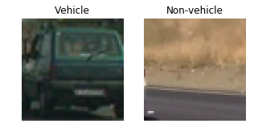
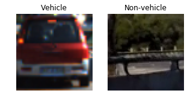
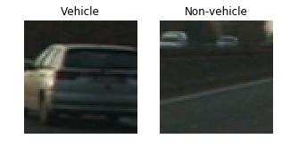

The dataset was fairly balanced with 8792 vehicle images and 8968 non-vehicle images.

I then explored different color spaces and different `skimage.hog()` parameters (`orientations`, `pixels_per_cell`, and `cells_per_block`).  I grabbed random images from each of the two classes and displayed them to get a feel for what the `skimage.hog()` output looks like.

Here is an example of a conversion to the "YCrCb" color space:

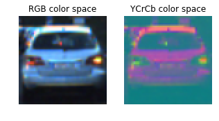

Here is an example of an image first converted to the "YCrCb" color space and then converted to HOG with parameters of `orientations=9`, `pixels_per_cell=(8, 8)` and `cells_per_block=(2, 2)`:

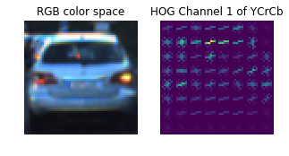

####2. Explain how you settled on your final choice of feature extraction parameters.
I combined spatial features, histogram features, and HOG features using the following parameters (code cell 5 of the jupyter notebook).

| Parameter        | Value   | 
|:-------------:|:-------------:| 
| Color space transformation (`color_space`)      | YCrCb        | 
| HOG orientations (`orient`)      | 9      |
| HOG pixels per cell (`pix_per_cell`)    | 8      |
| HOG cells per block (`cell_per_block`)      | 2        |
| Color channels used in HOG (`hog_channel`)      | 1, 2, and 3        | 
| Spatial binning dimensions (`spatial_size`)      | (16, 16)     |
| Number of histogram bins (`hist_bins`)   | 16      |

With the settings I selected, 6108 features were included. The parameters above were selected to have a good balance between processing speed and classification accuracy. Specifically, higher values of these parameters will yield more features and potentially greater classification accuracy. However, higher values will also require more processing power and therefore slower performance. 

I found the set of parameters in the table above a good compromise. However, It is likely that some of the features are not predictive and that there is a significant amount of correlation among features. Therefore, if I had more time, I would look to reduce the dimensionality of the features by a technique like principal component analysis. 

####3. Describe how (and identify where in your code) you trained a classifier using your selected HOG features (and color features if you used them).

After features were extracted, I normalized the data using the `StandardScaler()` function. Subsequently, I split the data randomly into a training (80%, or 14208 images) and testing (20%, or 3552 images) set using sklearn's `train_test_split` method.

I used the training set to train a linear SVM using sklearn's `LinearSVC` method. The accuracy of the classification on the testing set was 0.9882, which was sufficient to proceed with the project and use this classifier in video frames.

All of this is done in code cell 9 of the jupyter notebook.

###Sliding Window Search

####1. Describe how (and identify where in your code) you implemented a sliding window search.  How did you decide what scales to search and how much to overlap windows?

I used sliding window search from the middle of the images down. Since cars become larger the closer they are to the bottom of the image, I increased the size of the sliding window as one gets closer to the bottom of the image. This was done in the function `get_hot_windows_opt` in code cell 11 of the jupyter notebook. Specifically:
 * From y-value 400 to 475, I used a scaling factor of 0.75 (window of 48 pixels) in the `find_cars` function
 * From y-value 400 to 525, I used a scaling factor of 1.5 (window of 96 pixels) in the `find_cars` function
 * From y-value 400 to 600, I used a scaling factor of 2.0 (window of 128 pixels) in the `find_cars` function

By using this multi-scale approach in the sliding window search, I reduced the number of windows that need to be checked drastically in comparison to an approach where multiple window sizes are used for the whole area of interest. Reducing the number of windows as much as possible is important to maximize the performance of the analysis.

I found that the default overlap by moving the window by 2 boxes in each iteration worked well.

####2. Show some examples of test images to demonstrate how your pipeline is working.  What did you do to optimize the performance of your classifier?

Here are 4 example frames on which the sliding window classifier is applied (code cell 12 in jupyter notebook):

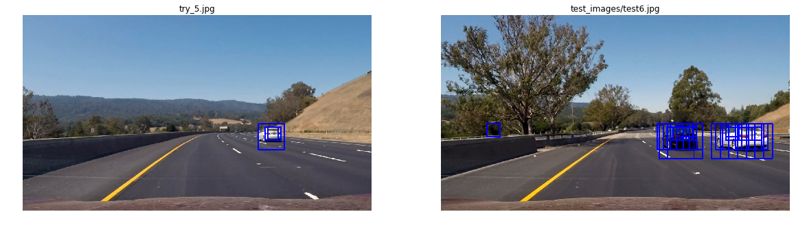

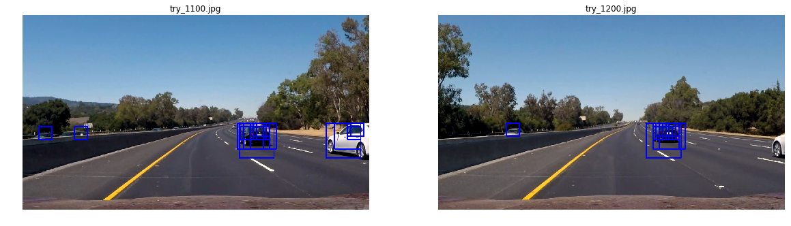

In this example, there are some false positive boxes. However, one can see that actual cars were detected by multiple windows. Therefore, a heat map approach will likely be succesful in eliminating false positives.

I optimized the performance of the classifier mainly by changing the start and end y-pixels for each of the three zones, as well as the corresponding scale value. I did not have to make any changes to the linear SVM classifier after training using the images provided

### Video Implementation

####1. Provide a link to your final video output.  Your pipeline should perform reasonably well on the entire project video (somewhat wobbly or unstable bounding boxes are ok as long as you are identifying the vehicles most of the time with minimal false positives.)
Here's a [link to my video result](./project_video_output.mp4)

####2. Describe how (and identify where in your code) you implemented some kind of filter for false positives and some method for combining overlapping bounding boxes.

I recorded the positions of positive detections in each frame of the video.  From the positive detections I created a heatmap and then thresholded that map to identify vehicle positions (code cell 13 in jupyter notebook).  I then used `scipy.ndimage.measurements.label()` to identify individual blobs in the heatmap.  I then assumed each blob corresponded to a vehicle.  I constructed bounding boxes to cover the area of each blob detected (see final pipeline in function `process_frame` of code cell 19 in jupyter notebook).  

I found that after applying `scipy.ndimage.measurements.label()`, some of the cars had multiple (non-overlapping) detection windows. In function `combine_boxes` of code cell 15 of my jupyter notebook, I implemented an algorithm to combine individual closeby detection windows by running a clustering pass on the bounding box centroids, using `sklearn.cluster.MeanShift()`. By tuning the `bandwidth` parameter of this method, I could get quite acceptable combination and separation of separate detection windows. I found that a bandwidth value of 150 was ideal as shown in the image below. 

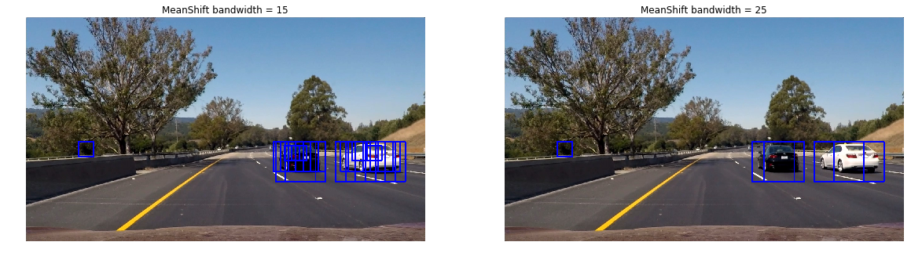
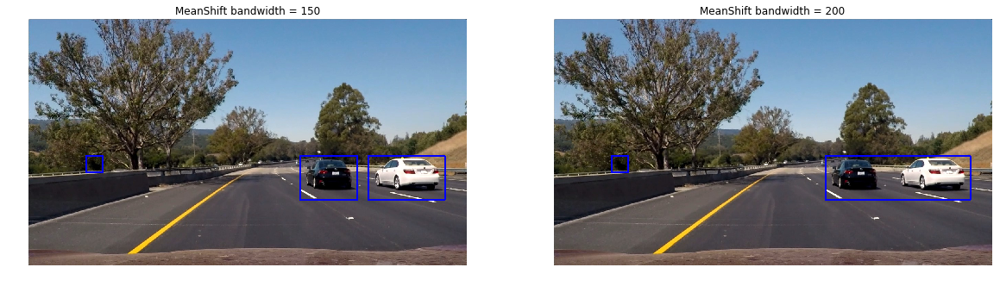

Note that a simple k-means clustering method was not usable since one needs to provide the number of clusters as an input to the k-means algorithm. With `MeanShift`, one does not need to do that. Instead, the `bandwidth` parameter specifies the critical distance above which two centroids should be in different clusters.

Here's an example showing the steps to combine the detection windows for 6 consecutive frames.

First, the classifier is applied to each of the 6 frames individually and 6 heatmaps from a series of frames of video are created. The following figure shows the 6 original frames and their corresponding heatmaps.

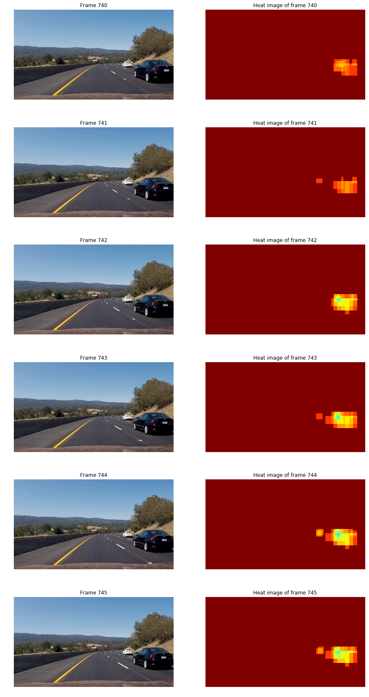

Next, the average of the 6 heatmaps is calculated and a threshold is applied where only pixels with an average heat of over 2 are retained. This thresholded heatmap is then used as input to `scipy.ndimage.measurements.label()`. The following figure shows the average heatmap over the 6 frames (left) and output of `scipy.ndimage.measurements.label()` on the averaged & thresholded heatmap (right)

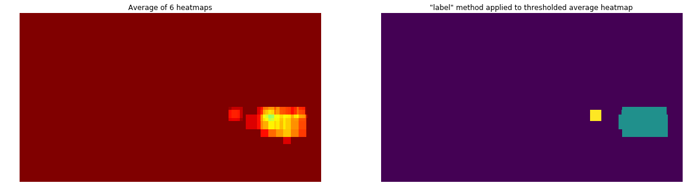

The result of the `scipy.ndimage.measurements.label()` method is used to calculated bounding boxes, which are then clustered using the `MeanShift` approach explained above. The following figure shows the final bounding boxes over the averaged heatmap (left) and the same bounding boxes over the original image (right)

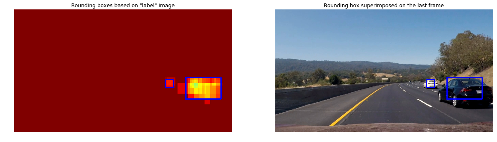

###Discussion

####1. Briefly discuss any problems / issues you faced in your implementation of this project.  Where will your pipeline likely fail?  What could you do to make it more robust?

**Performance**

* I achieved a performance of about 2 frames per second, which seems to be quite good in comparison to other students in the forum. If I had more time, I would look into increasing the performance by optimizing the number of features. This could potentially be done through a dimension reduction technique like principal components.
* I calculated the HOG transform in parallel over the 3 channels, which boosted performance by 10-20%. I tried implementing the 3 scales of sliding window method calls in parallel, but could not see a noticeable performance improvement. With more time, I would look into parallellizing the SVM classifier prediction. In the end, applying the SVM classifier on sliding windows is an embarassingly parallel problem.

**Classification accuracy**

* At times, some cars are not detected during some frames (i.e., false negatives) and objects that are not cars are flagged as cars (i.e., false positives), despite good thresholding and taking averages across multiple frames. I am not sure why some objects are wrongly classified. Visually, there is no clear similarity between the false positives and a vehicle or a false negative and a non-vehicle. Possibly, a different classifier would perform better. I found that the linear SVM classifier was quite finecky in general. While it performed quite well on the test image dataset, when applied to the actual videostreams, there were a lot of seemingly unexplicable false positives and a few false negatives as well. The one alternative classifier I would prioritize is a convolutional neural network (CNN). By unrolling the image features and feeding those into an SVM, one loses some of the spatial context and patterns in an image. Since a CNN retains some of the spatial relations in an image, I suspect it could perform quite well for this problem. In addition, it may be worth to add more training data, either from the udacity training dataset, or by manually creating some training dataset from the videostream.
* With more time, I would also implement a smarter multi-scale sliding window approach. Currently, I use three discrete zones with moving windows shifting 2 boxes over to achieve about 70% overlap. I would look into creating a fully continuous multi-scale sliding window approach.

**Overlapping cars and object tracking**

* My pipeline cannot distinguish cars that are overlapping closely. In addition, the approach taken can also not track the same car frame to frame as an individual object. In fact, the current classifier is not doing anything with the information that a car cannot change color or shape from one frame to the next frame. In each frame, the classifier checks for a generic car. The pipeline could be made more robust if we explicitly search for cars in the next frame that are (1) spatially close to a car in the previous frame, and (2) have the same shape and color as a car in the previous frame. This would enable the pipeline to be used for car object tracking. This could potentially be done by pattern matching, where an approach like the one used in the project would only be used to detect new cars, but once a new car is detected, an algorithm like pattern matching would be used to track the same car during the video feed.